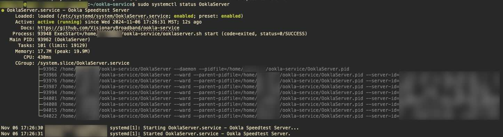
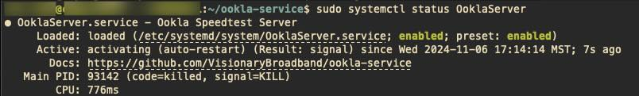
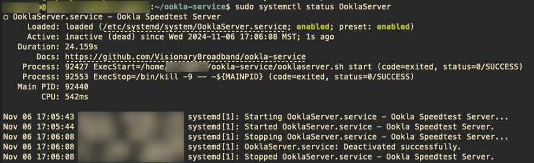

# ookla-service
This is an unofficial fork of Ookla's installation script for their Ookla Speedtest Server. Some of the differences
include:
- Creating a Service unit for SystemCTL to auto-start the daemon on boot and restart if failed
- Creating a central PID file for process termination
- Create a logrotate conf so the scripts logs get rotated
- Script runs on Bash instead of Posix and favors Debian based systems
- Script has much better error handling and logging and included a debug mode for verbose console output

### Install the Ookla Service

1. Clone this repo into your home directory
   1. ```shell
      git clone https://github.com/VisionaryBroadband/ookla-service.git 
      ```
2. Enter the repo directory and run the installation script to pull the latest daemon files from Ookla
   1. ```shell
      cd ookla-service \
      && ./ooklaserver.sh -v install
      ```
   2. The script will attempt to detect the platform, if that fails please select your platform from the prompt.
   3. Next the script will confirm you desire to install the files
   4. Then the script will proceed to download the latest files directly from Ookla
   5. Finally, the script will complete the installation by starting the service up and checking if all is working
3. If the installation completed successfully, you will stop the daemon and then start and enable the service,
so it will run automatically on each boot.
   1. ```shell
      ./ooklaserver.sh -v stop
      ```
   2. ```shell
      sudo systemctl enable OoklaServer \
      && sudo systemctl start OoklaServer \
      && sudo systemctl status OoklaServer
      ```

### Checking the status of the Ookla Service
This script will create and deploy a SystemD service unit that will handle invoking the script, terminating the processes, as well as restarting the processes if they fail. However, due to the lack of systemd's watchdog implementation in Ookla's Daemon the only healthcheck that systemd can perform is to monitor the main process via PIDFILE and so long as that process is running it is treated as **ACTIVE**. If that process crashes or is killed outside systemd then it will trigger the restart function and attempt to start the service up repeatedly. If you use systemctl to stop the service then it will report as **INACTIVE (dead)** as it should be, but this is only possible if systemd is the one to terminate the process.

The status can be checked with this command:
```shell
sudo systemctl status OoklaServer
```
which will result in an output like this:


If the Daemon has crashed or was killed externally, SystemD should try to restart it automatically and that would look like this


### Starting and Stopping the Ookla Service
You can start the service with this command: 
```shell
sudo systemctl start OoklaServer
```
You can stop the service with this command:
```shell
sudo systemctl status OoklaServer
```
which will result in an output like this:


### Uninstall the Ookla Service

The script has a built-in uninstaller that will clean up the SystemD service unit it created, the LogRotate unit it created, and the log directory that was also created. <mark>If you wish to retain the logs or this repo on your system, do not run this command!</mark>
```shell
~/ookla-service/ooklaserver.sh -v uninstall
```


### References

- [OoklaServer Installation - Linux / Unix](https://support.ookla.com/hc/en-us/articles/234578528-OoklaServer-Installation-Linux-Unix)
- [Ookla Linux Startup Script Options](https://support.ookla.com/hc/en-us/articles/234578588-Linux-Startup-Script-Options)
- [JMF-Networks](https://gist.github.com/JMF-Networks/367b6bc20b2e4120d6b17538ee6f8b52)

### Credits

- Ookla, LLC.